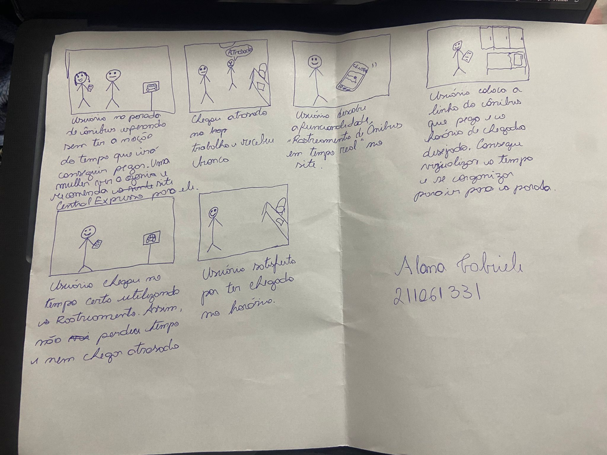
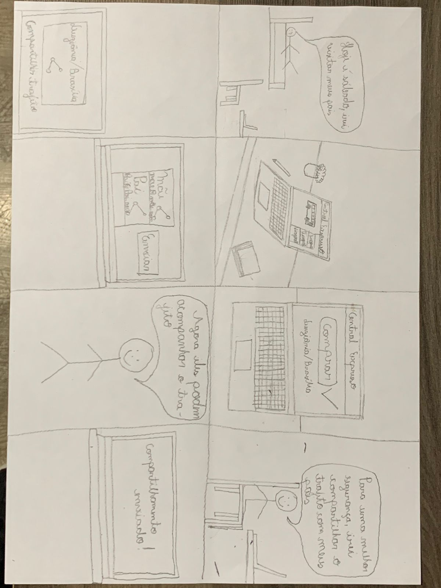
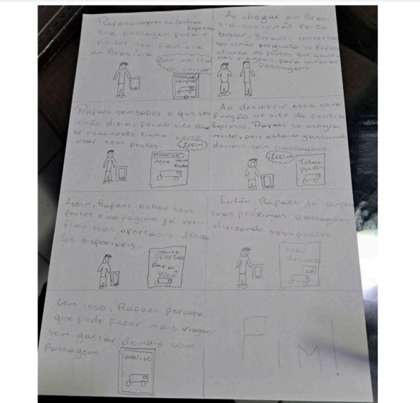
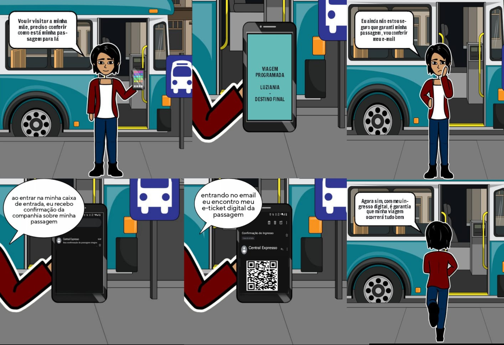
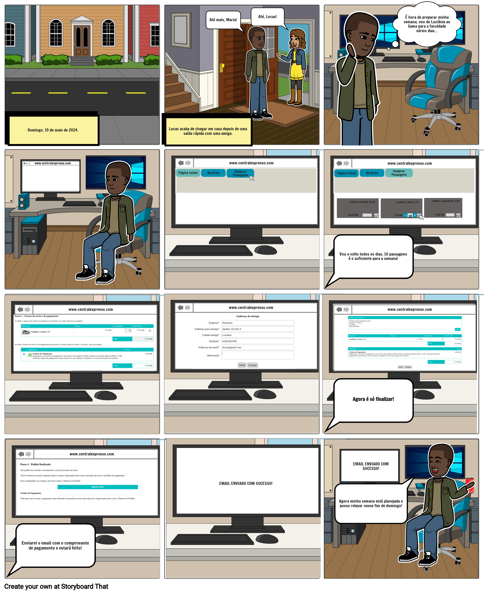

##  Introdução
Um storyboard é uma ferramenta visual usada para planejar e comunicar a interação entre humanos e computadores (IHC). Ele ajuda a ilustrar como os usuários irão interagir com o sistema ou aplicação através de uma série de quadros que mostram a sequência de eventos e ações.

## Metodologia
Cada membro do grupo elaborou o storyboard da sua respectiva funcionalidade, assim como pode ser verificado a seguir:

<ul>
<li> Alana Gabriele: Rastreamento de Ônibus em Tempo Real.  </li>
<li> Gustavo Alves: Compartilhamento de Trajetos. </li>
<li> Marco Tulio: Histórico de passagens compradas. </li>
<li> Pedro Henrique: Acúmulo de Pontos por Trajeto. </li>
<li> Renan Araújo: Acompanhar compra de passagem. </li>
<li> Yasmim Rosa: Comprar passagem. </li>
</ul>

## Rastreamento de Ônibus em Tempo Real
Na figura 1 está o storyboard da funcionalidade.

Figura 1 - Rastreamento de Ônibus em Tempo Real 

Fonte: [Alana Gabriele](https://github.com/alanagabriele) 

## Compartilhamento de Trajetos
Na figura 2 está o storyboard do compartilhamento do trajeto.

Figura 2 - Compartilhamento do trajeto 

Fonte: [Gustavo Alves](https://github.com/gustaallves)  

## Histórico de passagens compradas
Na figura 3 está o storyboard da funcionalidade.

Figura 3 - Histórico de passagens compradas 

Fonte: [Marco Tulio](https://github.com/MarcoTulioSoares) 

## Acúmulo de Pontos por Trajeto
Na figura 4 está o storyboard da funcionalidade.

Figura 4 - Acúmulo de Pontos por Trajeto 

Fonte: [Pedro Henrique](https://github.com/PedroHenrique061) 

## Acompanhar compra de passagem
Na figura 5 está o storyboard da funcionalidade.

Figura 5 - Acompanhar compra de passagem 

Fonte: [Renan Araújo](https://github.com/renantfm4) 

## Comprar passagem
Na figura 6 está o storyboard da funcionalidade.

Figura 6 - Comprar passagem 

Fonte: [Yasmim Rosa](https://github.com/yaskisoba) 

