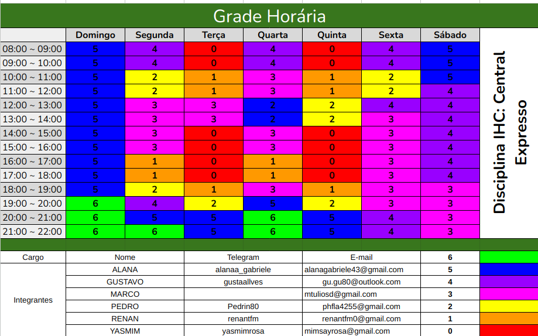

## Introdução
Tendo em vista que a disciplina de Interação Humano Computador é voltada a projeto e com um time de 6 pessoas se faz necessário técnicas de organização e gerenciamento para o bom desenvolvimento do produto final foi então escolhida uma metodologia para o prosseguimento do projeto.

## Heatmap
Foi elaborado um heatmap, onde cada membro da equipe informou seus horários de disponibilidade ou falta dela assim foi possível obter um panorama sobre os melhores horários para reuniões e realização de atividades.

### Horários para reuniões
<ul> 
<li> Sempre durante a noite, em especial nas segundas e quartas.</li>
</ul>

 Heatmap de Disponibilidade    Fonte: [Gustavo Alves](https://github.com/gustaallves)

## Metodologia: SCRUM Adapatado e Extreme programming
Por maior familiaridade dos membros da equipe e devido a característica de inversão do triângulo de ferro encontrada em metodologias ágeis onde o tempo se encontra como uma restrição importante e que é coerente com o projeto a ser desenvolvido o SCUM então foi elegido como a metodologia a ser utilizada no projeto juntamente a algumas técnicas do XP (Extreme programming).

### Práticas que serão utilizadas:
<ul>
<li>Daily (SCRUM): Reuniões rápidas feitas pelo whatsapp para alinhamento do andamento das atividades.</li>
<li>Retrospective (SCRUM): Reuniões entre a equipe feita ao final de uma entrega para buscar pontos de melhoria.</li>
<li>Review (SCRUM): Coleta dos feedbacks das apresentações para realização de refatorações e ajustes.</li>
<li>Pair Programming (XP): Técnica do XP, onde as tarefas são realizadas em pares e será utilizada durante a realização das atividades. </li>
</ul>

## Bibliografia
[1] GIFFONI, Nicolas. Quem é Jeff Sutherland? Conheça o “pai” do Scrum e sua trajetória. Disponível em: <https://www.ieepeducacao.com.br/jeff-sutherland/>. Acesso em: 6 de Abril de 2024.  
[2] ENGELBRETH, Eneida Xavier. O Triângulo Ágil de Restrições. Disponível em: <https://fixeconsulting.com/2017/03/o-triangulo-agil-de-restricoes/>. Acesso em: 6 de Abril de 2024.  
[3] SHARMA, Jatin. Pair Programming: Best Practices and Tools. Disponível em: <https://dev.to/documatic/pair-programming-best-practices-and-tools-154j>. Acesso em: 6 de Abril de 2024.
AWS. O que é Scrum. Disponível em: <https://aws.amazon.com/pt/what-is/scrum/>. Acesso em: 6 de Abril de 2024.

## Histórico de Versões

| Versão |    Data    | Descrição                                 | Autor(es)                                       | Revisor(es)                                    |
| ------ | :--------: | ----------------------------------------- | ----------------------------------------------- | ---------------------------------------------- |
| 1.0    | 07/04/2024 | Metodologia e Heatmap | [Yasmim Rosa](https://github.com/yaskisoba) |   [Gustavo Alves](https://github.com/gustaallves) |