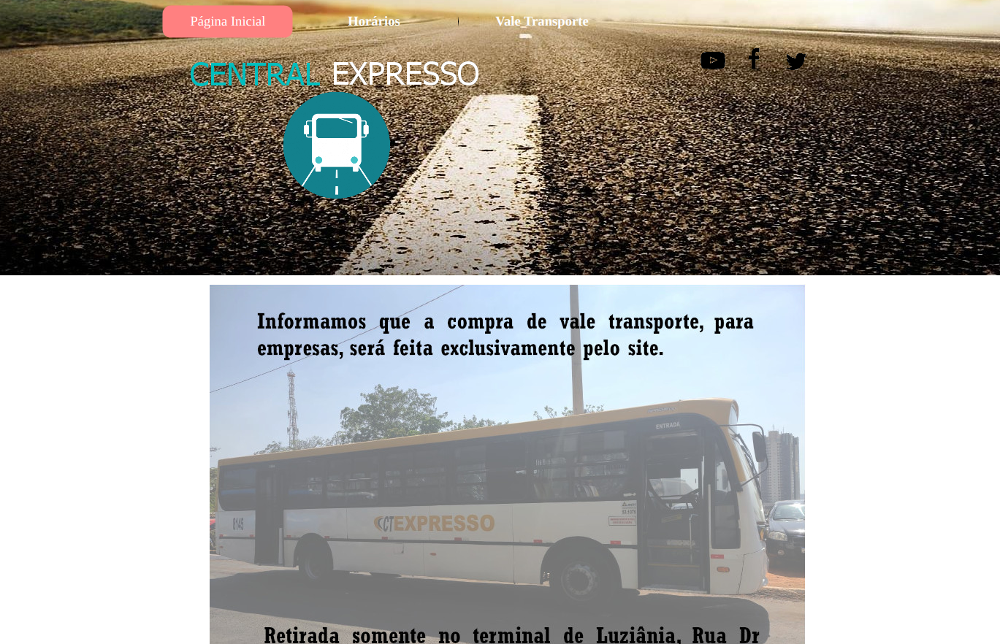
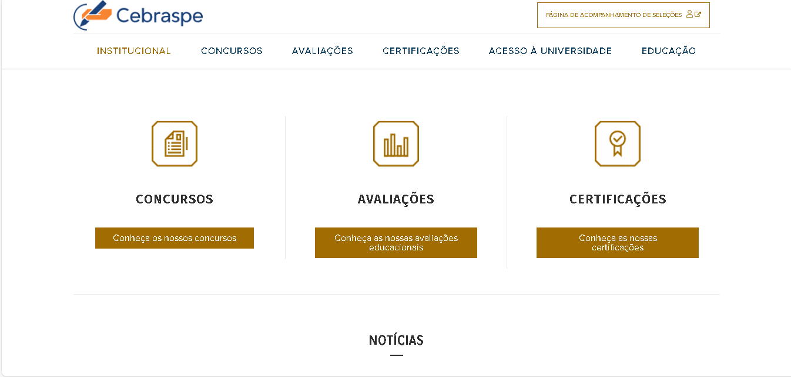

# Sites Avaliados

## Introdução

Na disciplina, cada integrante do grupo ficou responsável por planejar, com o framework DECIDE, e avaliar um site escolhido individualmente. Assim foi possível que cada um obtivesse experiência com os conceitos abordado na disciplina possibilitando uma compreensão das características, funcionalidades e experiência do usuário de cada plataforma. Através dessas avaliações individuais, buscamos identificar pontos fortes, fracos e possíveis melhorias. 
Essa atividade também proporcionou insumos para a escolha de um site para realização da avaliação de IHC em equipe. Na **tabela 13** estão cada site que cada membro avaliou.

| Nome |    Site Avaliado    | 
| ------ | :--------: | 
  [Alana Gabriele](https://github.com/alanagabriele/alanagabriele) | SIGAA |
  [Gustavo Alves](https://github.com/gustaallves)  | REAPER | 
  [Marco Tulio](https://github.com/MarcoTulioSoares) | Embaixada Americana |
  [Pedro Henrique](https://github.com/PedroHenrique061) | Central Expresso |
  [Renan Araújo](https://github.com/renantfm4)   | CEBRASPE |     
  [Yasmim Rosa](https://github.com/yaskisoba) | DF no Ponto |

  
Tabela 13 - Sites avaliados por membros da equipe    Fonte: [Gustavo Alves](https://github.com/gustaallves)

## SIGAA

O SIGAA (Sistema Integrado de Gestão de Atividades Acadêmicas) é uma plataforma desenvolvida para gerenciar atividades acadêmicas e administrativas. Utilizado por diversas instituições de ensino superior, o SIGAA oferece funcionalidades como matrícula em disciplinas, emissão de histórico escolar e gerenciamento de eventos acadêmicos.

## REAPER

“REAPER é um aplicativo completo de produção de áudio digital para computadores, oferecendo
um conjunto completo de ferramentas de gravação, edição, processamento, mixagem e
masterização de áudio multipista e MIDI.” (Reaper, 2024)

### Pontos Fortes
- A proposta é interessante no quesito de centralizar diversas ferramentas.

### Pontos Fracos
- Paleta de cores não agradável e dificulta a leitura.
- Informações não bem destacadas e distribuídas na página principal.
- Letras pequenas na página principal dificultam a leitura.
- Navegação não intuitiva e confusa.

### Sugestões de Melhorias
- Melhorar a paleta de cores para tornar o site mais agradável e facilitar a leitura.
- Reorganizar e destacar as informações na página principal para melhorar a clareza e a
organização.
- Aumentar o tamanho das letras na página principal para melhorar a legibilidade.
- Aprimorar a navegação do site para torná-la mais intuitiva e fácil de usar.

## Embaixada Americana

O site da Embaixada Americana oferece informações sobre os serviços consulares, vistos, relações bilaterais entre os Estados Unidos e o país hospedeiro, eventos culturais e notícias atualizadas.

## Central Expresso 

O site Central Expresso é uma plataforma especializada na venda de passagens de ônibus, oferecendo aos usuários a facilidade de consultar horários, destinos e informações detalhadas sobre suas linhas.

### Pontos Fortes
- É um site bem "cru" então não tem muita complexidade.

### Pontos Fracos
- Não informa ao usuário o status do sistema.
- A informações são organizadas de maneira confusa.
- Falta a definição de um padrão.

### Sugestões de Melhorias

- Melhorar a acessibilidade com botões mais intuitivos;
- Personalização de tema;
- Recursos intuitivos para facilitar o uso do usuário;

## CEBRASPE

O CEBRASPE (Centro Brasileiro de Pesquisa em Avaliação e Seleção e de Promoção de Eventos) é uma instituição líder na organização de concursos públicos e processos seletivos no Brasil. Seu site fornece informações sobre editais, resultados e serviços relacionados, facilitando a participação dos candidatos nos certames organizados pela instituição.

### Pontos Fortes

- O site oferece uma ampla gama de informações sobre concursos e processos, incluindo editais, calendários, gabaritos e resultados.

### Pontos Fracos

- Dificuldade ao fazer autenticação na conta, muitas vezes quando vai logar o site cai e ou dá sessão expirada.
- Ausência de acessibilidade.
- O design do site pode parecer um pouco antiquado e pode não oferecer uma experiência visual atraente para os usuários.

### Sugestões de melhorias 

- Investir em uma atualização do design do site para torná-lo mais moderno e atrativo visualmente pode melhorar a experiência do usuário.
- Incluir ferramentas de acessibilidade
- Revisar sua infraestrutura de autenticação para identificar possíveis falhas ou gargalos, o que é notável sempre que alguém tenta logar com sua conta no site.
## DF no Ponto

O DFnoPonto é um sistema de consulta de horários e linhas de transporte público no Distrito Federal. Com ele, você pode verificar itinerários, visualizar trajetos e obter informações sobre os pontos de parada. Além disso, o DFnoPonto também oferece a localização em tempo real dos ônibus via sinal de GPS.

### Pontos Fortes
- Uma abordagem boa para centralização de informações sobre linhas de ônibus;
- É fácil para procurar por linhas de ônibus já conhecidas.

### Pontos Fracos
- Não possui opções de acessibilidade;
- Uma procura por linhas de ônibus por parada é mais complexa e demorada para quem dispõe de pouco tempo ou pouca experiência com sistemas interativos;
- Funcionalidades que os usuários não entendem seu objetivo como: GeoMobi e veículos.

### Sugestões de Melhorias
- Inclusão de opções de acessibilidade;
- Inserção de explicações ou exemplos nas funcionalidades já que abrange um público diverso.

## Embaixada e Consulados dos EUA no Brasil
Site destinado a turistas brasileiros que desejam emitir seu visto para visitar os Estados Unidos

### Pontos Fortes
- Site com poucas etapas para o objetivo pretendido;
- Algumas páginas são bastante intuitivas.
### Pontos Fracos
- Site em inglês sem a possibilidade de tradução;
- A página ocupa só metade da tela;
- Pouca usabilidade;
- Botões se localizam em lugares pouco intuitivos.
## Sugestões de Melhorias
- Ajuste Autom´atico da Interface ao Tamanho da Tela;
- Tradução Completa e Revisão Linguística;
- Aumento da Fonte e Contraste Apropriado;
- Localização Estratégica dos Botões.

## Bibliografia
> SIGAA UnB. Disponível em: [Link para SIGAA UnB](https://autenticacao.unb.br/sso-server/login?service=https%3A%2F%2Fsig.unb.br%2Fsigaa%2Flogin%2Fcas). Acesso em 11 de abril de 2024.  
> REAPER. Disponível em: [Link para REAPER](https://www.reaper.fm/). Acesso em 11 de abril de 2024.  
> Embaixada Americana. Disponível em: [Link para Embaixada Americana](https://ceac.state.gov/genniv/). Acesso em 11 de abril de 2024.  
> Central Expresso. Disponível em: [Link para Central Expresso](https://www.centralexpresso.com/). Acesso em 11 de abril de 2024.  
> CEBRASPE. Disponível em: [Link para CEBRASPE](https://www.cebraspe.org.br/). Acesso em 11 de abril de 2024. <br:>
> DF no Ponto. Disponível em: [Link para DF no Ponto](https://dfnoponto.semob.df.gov.br/). Acesso em 11 de abril de 2024.

## Histórico de Versões

| Versão |    Data    | Descrição                                 | Autor(es)                                       | Revisor(es)                                    |
| ------ | :--------: | ----------------------------------------- | ----------------------------------------------- | ---------------------------------------------- |
| 1.0    | 05/04/2024 | Sites avaliados | [Pedro Henrique](https://github.com/PedroHenrique061) |   [Yasmim Rosa](https://github.com/yaskisoba)  |
