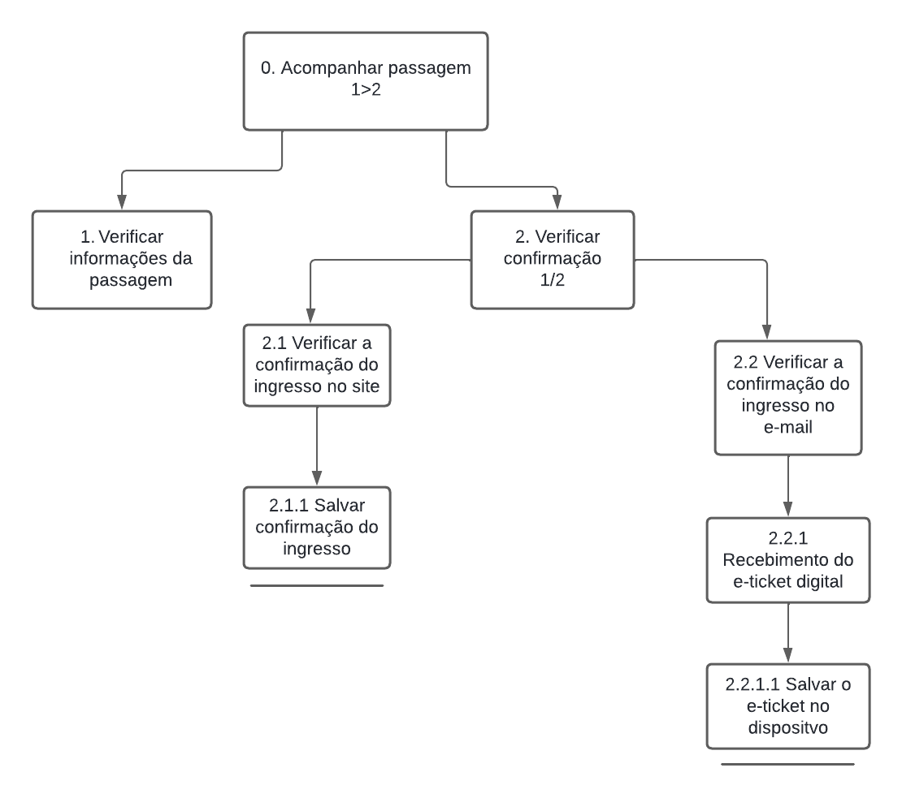
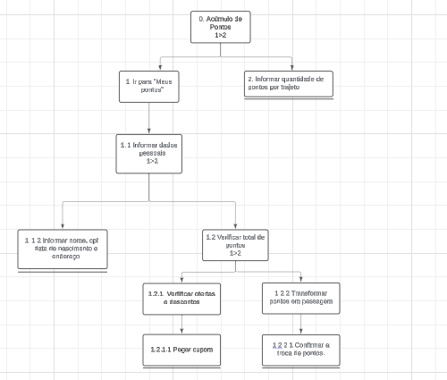

## Introdução
A análise de tarefas é utilizada para entender uma tarefa realizada pelo usuário, como ele a realiza e o por quê, uma técnica para realizar a análise de tarefas é chamada HTA (Hierarchical Task Analysis) que se baseia em psicologia funcional.  
No HTA o foco é primeiramente nos objetivos de alto nível que por sua vez são decompostos em subobjetivos e assim por diante.

## Metodologia
### Hierarchical Task Analysis

Como anteriormente citado, o HTA se inicia em um objetivo e vai se decompondo em subojetivos com relações entre si chamadas de plano. Um plano define os subobjetivos necessários para alcançar um outro objetivo maior, e a ordem em que esses subobjetivos devem ser alcançados (Barbosa e Silva, 2010).  
Quando um subjetivo se decompõe até seu nível mais básico, ele se converte em uma operação que é a unidade fundamental em HTA. Na Figura 24, estão os elementos e relações do HTA:

 Figura 23 - Elementos e relações HTA 

 Fonte: BARBOSA, S. D. J.; SILVA, B. S. Interação Humano-Computador. Rio de Janeiro: Elsevier, 2011.   

## Análise de Tarefas com HTA

### Rastreamento de Ônibus em Tempo Real
Nessa tarefa o usuário tem o objetivo de rastrear um ônibus.

 Figura 24 - HTA Rastreamento de ônibus em tempo real 

  

 Fonte: [Alana Gabriele](https://github.com/alanagabriele)

 Tabela 22 - HTA Rastreamento de ônibus em tempo real 

| **Objetivos / Operações** | **Problemas e Recomendações** |
|---------------------------|-------------------------------|
| **0. Rastrear Ônibus** |  |
| **1. Ir para 'Minhas Passagens'** | **input**: Clique na seção 'Minhas Passagens'.   **feedback**: A seção de passagens é carregada com todas as passagens compradas listadas.   **plano**: Garantir que a seção carregue rapidamente e mostre todas as informações relevantes.    |
| **1.1 Localizar passagem** | **input**: Seleção da passagem desejada.    **plano**: Assegurar que os detalhes úteis da passagem sejam facilmente legíveis.    |
| **1.1.1 Verificar os dados da passagem** |  **feedback**: Todas as informações necessárias são apresentadas.  |
| **2. Ir para 'Rastreamento em tempo real'** | **input**: Selecionar a opção no menu.   **feedback**: Tela de rastreamento é exibida com opções para localizar os ônibus.  |
| **2.1 Informar o número da linha e o horário de chegada desejado** | **input**: Entrada do número da linha e horário.   **feedback**: Sistema busca e mostra o status atualizado do ônibus.   **plano**: Reduzir erros de entrada de dados.   **recomendação**: Implementar validação de dados no campo de entrada. |
| **2.2 Verificar a localização do ônibus** | **input**: Visualização no mapa.   **feedback**: Mapa mostra a localização atual do ônibus.   **plano**: Melhorar a precisão do sistema de rastreamento.    |
| **2.2.1 Ativar o recebimento de notificação** | **input**: Opção de ativar notificações selecionada.   **feedback**: Usuário recebe confirmação de que as notificações estão ativas.   **plano**: Garantir entrega de notificações em tempo real.   **recomendação**: Testar e assegurar a confiabilidade do sistema de notificações. |
| **2.2.2 Informar o número de telefone** | **input**: Entrada do número de telefone no formulário.   **feedback**: Número é registrado para notificações via SMS.   **plano**: Proteger a privacidade dos dados do usuário.    |

 Fonte: [Alana Gabriele](https://github.com/alanagabriele)

### Compartilhamento de Trajetos 
Nessa tarefa o usuário tem o objetivo de compartilhar o trajeto de sua passagem.

 Figura 25 - HTA compartilhar informações sobre uma viagem. 

  

 Fonte: [Gustavo Alves](https://github.com/gustaallves)

 Tabela 23 - HTA compartilhar informações sobre uma viagem. 

| **Objetivos / Operações**                                     | **Problemas e Recomendações**                                                                                                          |
|---------------------------------------------------------------|----------------------------------------------------------------------------------------------------------------------------------------|
| **0. Compartilhamento de viagem**                             | **input**: Acesso ao site Central Expresso.  **feedback**: Usuário deve identificar claramente as opções de compartilhamento.  **plano**: Assegurar que a opção de compartilhamento seja visível e acessível. |
| **1. Compartilhar informações sobre uma viagem**              | **input**: Seleção da opção de compartilhamento na página de detalhes da viagem.  **feedback**: Mostrar uma tela de compartilhamento simplificada.  **plano**: Reduzir cliques desnecessários e simplificar a interface. |
| **1.1 Identificar a viagem desejada**                         | **input**: Pesquisa e seleção da viagem.  **feedback**: A viagem selecionada é exibida com todos os detalhes relevantes.  **plano**: Melhorar o sistema de busca para que os resultados sejam mais precisos e rápidos. |
| **1.2 Acessar a opção de compartilhamento**                   | **input**: Clique na opção 'Compartilhar' disponível nos detalhes da viagem.  **feedback**: Deve haver uma clara confirmação visual de que a opção foi ativada.  **plano**: Certificar-se de que o botão de compartilhamento é facilmente identificável. |
| **1.2.1 Selecionar os contatos para compartilhamento**        | **input**: Selecionar contatos da lista ou inserir novos e-mails.  **feedback**: Contatos devem ser facilmente adicionáveis e selecionáveis.  **plano**: Integrar uma funcionalidade para sugerir contatos frequentes e permitir a inserção rápida de novos e-mails. |
| **1.2.2 Informar nome e e-mail**                              | **input**: Inserir manualmente os dados de novos contatos.  **feedback**: Os campos para entrada de dados devem ser claros e o formato exigido deve ser validado em tempo real.  **plano**: Assegurar validação e feedback imediato de erros de formatação. |
| **1.2.1.1 Enviar as informações da viagem**                   | **input**: Clicar no botão 'Enviar'.  **feedback**: Confirmação de que as informações foram compartilhadas.  **plano**: Oferecer uma mensagem clara e direta de sucesso no compartilhamento. |
| **2. Acompanhar compartilhamento**                            | **input**: Acesso a uma seção específica que permita ver o status do compartilhamento.  **feedback**: Informações detalhadas sobre quem visualizou o compartilhamento.  **plano**: Desenvolver uma funcionalidade que permita ao usuário acompanhar quem já acessou as informações compartilhadas. |

 Fonte: [Gustavo Alves](https://github.com/gustaallves)

### Histórico de passagens compradas
Nessa tarefa o usuário tem o objetivo de ver seu historico de passagens.

 Figura 26 - HTA consultar historico de passagens 

  

 Fonte: [Marco Tulio](https://github.com/MarcoTulioSoares)

 Tabela 24 - HTA Histórico de Passagens de Ônibus Compradas 

| **Objetivos / Operações** | **Problemas e Recomendações** |
|---------------------------|-------------------------------|
| **0. Visualizar Histórico de Passagens** |  |
| **1. Navegar para a seção 'Histórico de Passagens'** | **input**: Clique na aba "Histórico" no menu.   **feedback**: A seção é carregada com todas as passagens listadas.   **plano**: Garantir que a seção carregue rapidamente e mostre todas as informações relevantes.   |
| **1.1 Localizar passagem desejada** | **input**: Seleção da passagem na lista.   **plano**: Garantir que as informações estejam ordenadas por data ou outra categoria útil.   |
| **1.1.1 Verificar os dados da passagem** | **feedback**: Todas as informações necessárias são apresentadas (data, origem, destino, status).   **plano**: Certificar que os dados estejam precisos e atualizados.   |
| **2. Conferir o status da passagem** | **input**: Visualizar o status da passagem na tela de detalhes.   **feedback**: O status da passagem é claramente indicado (confirmada, utilizada, cancelada).   |
| **3. Realizar ações adicionais** | **input**: Escolha de opções adicionais, como baixar comprovante ou solicitar reembolso.   **feedback**: As ações são processadas conforme a escolha do usuário.   **plano**: Certificar-se de que as opções disponíveis sejam claras e acessíveis.   |
| **3.1 Baixar comprovante ou solicitar reembolso** | **input**: Clique na opção de comprovante ou reembolso.   **feedback**: O comprovante é baixado ou o reembolso é solicitado.   **plano**: Garantir que a funcionalidade seja intuitiva e rápida.   |

 Fonte: [Marco Tulio](https://github.com/MarcoTulioSoares)

### Acúmulo de Pontos por Trajeto

Nessa tarefa o usuário tem o objetivo de acompanhar o total de pontos obtidos.

 Figura 27 - HTA consultar acúmulo de pontos 

  

 Fonte: [Pedro Henrique](https://github.com/PedroHenrique061)

 Tabela 25 - HTA Histórico de pontos obtidos 

| Objetivos / Operações       | Relações | Problemas e Recomendações                            |
|-----------------------------|----------|------------------------------------------------------|
| 0.Visualizar Acúmulo de Pontos        | 1 > 2    | Input: Acúmulo de Pontos. |
| 1. Navegar para a seção 'Acúmulo de Pontos'        |    | Input: Clique na aba "Meus Pontos" no menu.   Feedback: A seção é carregada com todos os pontos acumulados.|
| 1.1 Informar dados pessoais   | 1 > 2    | Input: Dados pessoais.   Feedback: Validação e confirmação dos dados inseridos. |
| 1.1.2 Informar nome, CPF, data de nascimento e endereço | | Input: Nome, CPF, data de nascimento e endereço.   Feedback: Verificação e correção de erros nos dados. |
| 1.2  Verificar total de pontos |     1 > 2     | Input: São apresentados todos os pontos já obtidos.  |
| 1.2.1 Verificar ofertas e descontos   |          |  Input: Seleção de ofertas e descontos.  Feedback: A seção é carregada com todas ofertas e descontos disponíveis.|
| 1.2.1.1 Pegar cupom               |          |Feedback: Cupom selecionado. |
| 1.2.2 Transformar pontos em passagem   |          |  Input: Seleção da quantidade de pontos.    Feedback: Verificação detalhada da troca dos pontos.|
| 1.2.2.1 Confirmar a troca de pontos               |          |Feedback: Comprovante e detalhes da troca. |
| 2. Informar quantidade de pontos por trajeto | | Input: Ir para aba de trajetos.   Feedback: Quantidade de pontos por trajeto é apresentada. |

 Fonte: [Pedro Henrique](https://github.com/PedroHenrique061)

### Acompanhar compra de passagem

 Figura 28 - HTA Acompanhar compra de passagem 

  

 Fonte: [Renan Araújo](hhttps://github.com/renantfm4)

 Tabela 26 - Acompanhar compra de passagem 

| **Objetivos / Operações** | **Problemas e Recomendações** |
|---------------------------|-------------------------------|
| **0. Acompanhar passagem** |  |
| **1. Verificar informações das passagens** | **input**: Clique na seção 'Ingressos Comprados'.   **feedback**: A seção ingressos aparece com os ingressos já comprados   **plano**: Garantir que a seção carregue rapidamente e mostre todas as informações relevantes.    |
| **2. Verificar confirmação** | **input**: Seleção da passagem desejada.    **plano**: Assegurar que os detalhes úteis da passagem sejam facilmente legíveis.    |
| **2.1 Verificar a confirmação do ingresso no site** |  **feedback**: Todas as informações necessárias que o ingresso está confirmado |
| **2.1.1 Salvar confirmação do ingresso** | **input**: Selecionar o ingresso   **feedback**: Tela aparece com o status de ingresso confirmado para viagem  |
| **2.2 Verificar a confirmação do ingresso no email** |   **feedback**: Todas as informações necessárias que o ingresso está confirmado   |
| **2.2.1 Recebimento do e-ticket digital** | **input**: No e-mail de confirmação do ingresso, descer a seção e selecionar o e-ticket  **feedback**: Receber as informações da passagem  |
| **2.2.1.1 Salvar o e-ticket no dispositivo** | **input**: Seção de "Salvar no disposito"   **feedback**: Usuário recebe o e-ticket armazenado no seu dispositvo pra visualizar as informações a qualquer momento   |

 Fonte: [Renan Araújo](hhttps://github.com/renantfm4)

### Comprar passagem
Nessa tarefa o usuário tem o objetivo de comprar sua passagem de ônibus.

 Figura 29 - HTA Comprar passagem 

 

 Fonte: [Yasmim Rosa](hhttps://github.com/yaskisoba)

 Tabela 27 - Comprar passagem 

| Objetivos / Operações       | Relações | Problemas e Recomendações                            |
|-----------------------------|----------|------------------------------------------------------|
| 0. Comprar passagem         | 1 > 2    | Input: Linha do ônibus.   Feedback: Apresentação das opções de passagens disponíveis e preços. |
| 1. Selecionar linha         | 1 > 2    | Input: Linha desejada.|
| 1.1 Informar a quantidade de passagens |          | Input: Quantidade de passagens de determinada linha.   |
| 1.2 Adicionar ao carrinho    |          | Feedback: Ícone do carrinho com um novo número. |
| 2. Informar dados pessoais   | 1 > 2    | Input: Dados pessoais.   Feedback: Validação e confirmação dos dados inseridos. |
| 2.1 Informar nome, CPF, data de nascimento e endereço | | Input: Nome, CPF, data de nascimento e endereço.   Feedback: Verificação e correção de erros nos dados. |
| 2.2 Escolher forma de pagamento | 1/2    | Input: Indicar forma de pagamento.   Feedback: Confirmação do pagamento. |
| 2.2.1 Pagamento com cartão   |          | Input: Inserir dados do cartão.   Feedback: Passa para o processamento do pagamento. |
| 2.2.1.1 Pagar                |          | Feedback: Comprovante de pagamento e detalhes da compra. |
| 2.2.2 Pagamento com PIX      |          | Feedback: Código e QR CODE. |
| 2.2.2.1 Pagar                |          |Feedback: Comprovante de pagamento e detalhes da compra. |

 Fonte: [Yasmim Rosa](hhttps://github.com/yaskisoba)

## Bibliografia
> BARBOSA, S. D. J.; SILVA, B. S. Interação Humano-Computador. Rio de Janeiro: Elsevier, 2011.  

## Histórico de Versões

| Versão |    Data    | Descrição                                 | Autor(es)                                       | Revisor(es)                                    |
| ------ | :--------: | ----------------------------------------- | ----------------------------------------------- | ---------------------------------------------- |
| 1.0    | 05/05/2024 | HTA | [Yasmim Rosa](https://github.com/yaskisoba)    | [Gustavo Alves](https://github.com/gustaallves)    |
