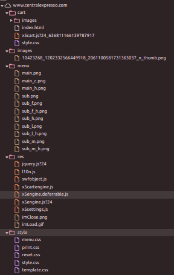

## Introdução
A compreensão aprofundada das funcionalidade e dinâmicas da plataforma permite uma perspectiva abrangente do seu funcionamento e nesse artefato serão destacadas as características da plataforma, atividade essencial na análise de requisitos da Engenharia de Usabilidade de Mayhew, e suas limitações.

## Características da Plataforma
O site da Central Expresso é um sistema que permite que o usuário compre antecipadamente suas passagens e veja os horários de suas linhas, suas funcionalidades são não somente simples mas apresentadas de maneira semelhante a sistemas mais antigos, pode ser acessado de qualquer dispositivo com acesso a internet mesmo em dispositivos móveis embora não tenha um aspecto muito responsivo.  
Em relação as tecnologias utilizadas, não existe uma documentação que aponta quais são usadas mas com a utilização da opção "inspecionar" disponível nos navegadores de internet foi possível verificar o uso de HTML, CSS e Javascript, o que é coerente ao aspecto simples do site, a hierarquia dos documentos que compõem o site estão na **Figura 1**.

 Figura 1 - Tecnologias utilizadas 

 Fonte: [Yasmim Rosa](https://github.com/yaskisoba)

## Limites
<ul>
<li>Devido a não considerar o uso em diversos dispositivos (responsividade) limita a usabilidade do site.</li>
<li>Não inclui todo o público ao não oferecer recursos de acessibilidade.</li>
<li>O usuário não pode buscar especificamente uma linha, deve buscar na imagem a linha que deseja ver o horário.</li>
<li>O uso de imagens para visualizar as linhas diminui a usabilidade do site.</li>
<li>Há ícones para redes sociais da empresa que não funcionam.</li>
<li>O site devia dar maior ênfase na possibilidade de comprar passagens, mas foca no caráter informativo</li>
</ul>

## Bibliografia
> BARBOSA, S. D. J.; SILVA, B. S. Interação Humano-Computador. Rio de Janeiro: Elsevier, 2011.  

## Histórico de Versões

| Versão |    Data    | Descrição                                 | Autor(es)                                       | Revisor(es)                                    |
| ------ | :--------: | ----------------------------------------- | ----------------------------------------------- | ---------------------------------------------- |
| 1.0    | 11/05/2024 |  Características da Plataforma | [Yasmim Rosa](https://github.com/yaskisoba)    |    [Renan Araújo](https://github.com/renantfm4)    |
