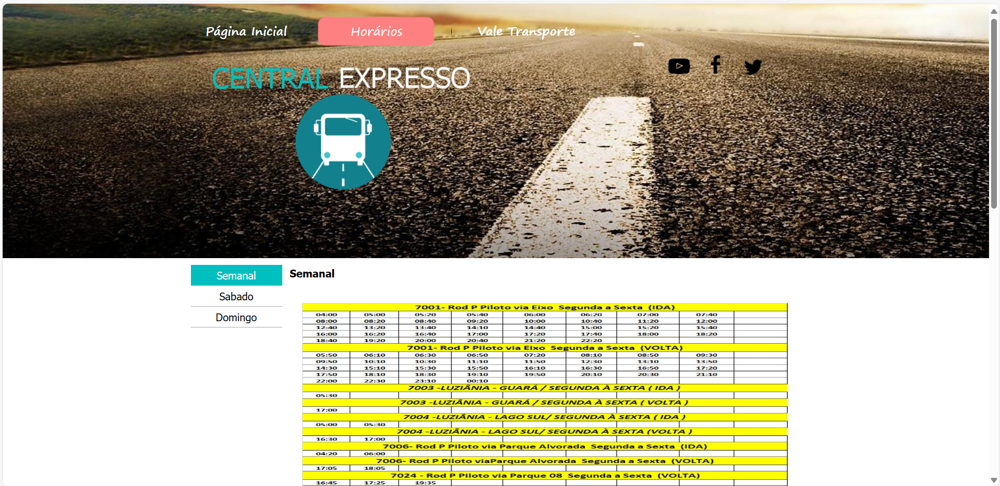
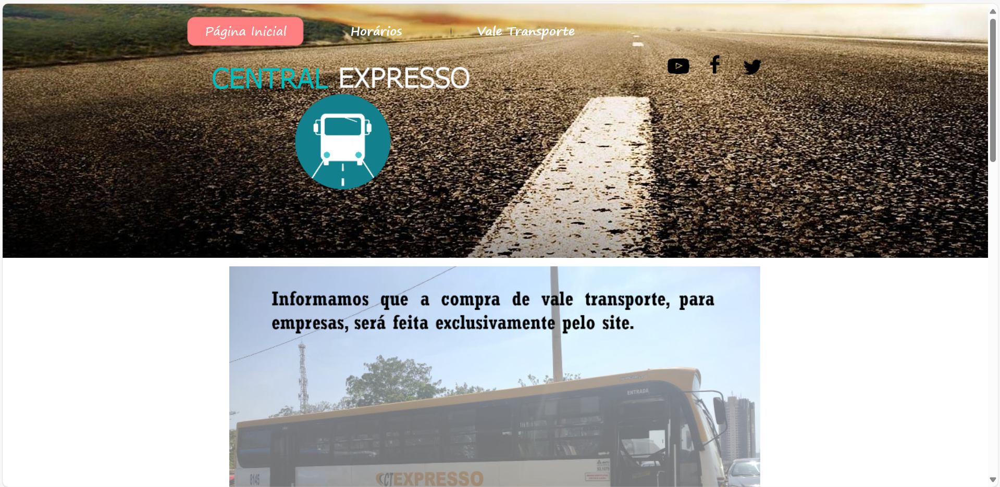
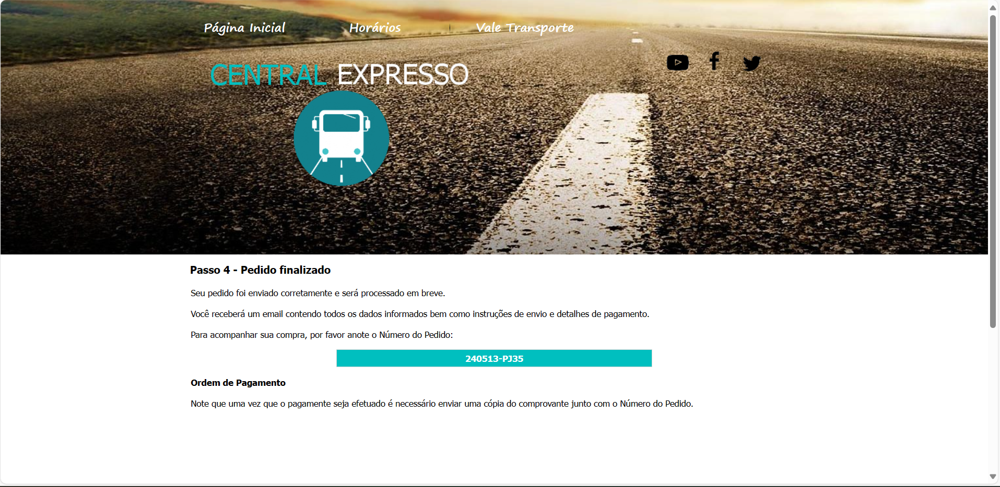
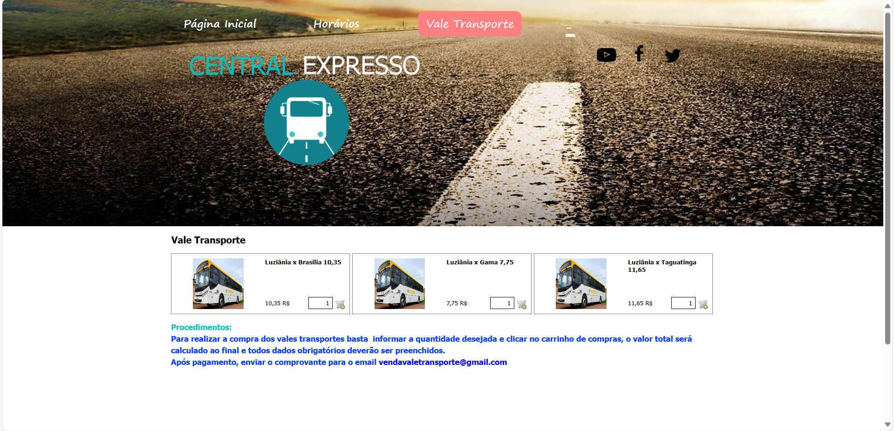

## Introdução

Os princípios gerais são fundamentais para o desenvolvimento de interfaces eficazes e satisfatórias. Eles abrangem uma série de considerações projetadas para atender e superar as expectativas dos usuários, enquanto simplificam as tarefas e mantêm um equilíbrio entre o controle e a liberdade dos usuários. Além disso, buscam garantir a consistência e padronização, promover a eficiência, antecipar necessidades, e proporcionar visibilidade e reconhecimento adequados. Ao mesmo tempo, esses princípios orientam o design para preparar e responder aos erros de forma construtiva. A aplicação desses princípios no design de interação e de interface será discutida detalhadamente nas próximas seções do documento.

## Metodologia

A metodologia adotada para a análise do site da Central Expresso teve como objetivo identificar os princípios gerais priorizados pela plataforma, bem como os que poderiam ser melhor implementados ou mais adequados ao contexto do sistema. Inicialmente, o grupo definiu uma lista dos principais Princípios Gerais a serem considerados, incluindo usabilidade, acessibilidade, simplicidade. Em seguida, foi realizada uma análise do site, focando na identificação de pontos fortes e desafios em relação a esses princípios. Durante essa observação, foram destacados os princípios que pareciam ser mais enfatizados pelo site da Central Expresso, bem como aqueles que poderiam ser aprimorados para melhor atender às expectativas dos usuários e aos objetivos da plataforma.

## Princípios Gerais 

### 1- Correspondência com as expectativas dos usuários

#### Definição

Este princípio enfatiza a importância de projetar sistemas que se alinhem com o que os usuários esperam experienciar, tanto em termos de funcionalidade quanto de comportamento do sistema, facilitando assim uma curva de aprendizado mais suave e uma experiência de usuário mais satisfatória.

#### Violação

Na figura 1, é possível identificar uma clara violação do princípio da Correspondência com a Expectativa dos Usuários. Este princípio sugere que os elementos de interface devem atender às expectativas prévias dos usuários, facilitando a navegação e a realização de tarefas. No entanto, na figura apresentada, não há nenhum botão ou indicação clara de onde é possível comprar uma passagem. Isso pode causar confusão e frustração nos usuários, que esperam encontrar um caminho direto e intuitivo para realizar essa ação. A ausência de rótulos descritivos ou ícones reconhecíveis que orientem os usuários para a compra de passagens representa um problema significativo de usabilidade, pois dificulta a interação eficiente e a satisfação do usuário com o sistema.

 Figura 1 - Correspondência com as expectativas dos usuários 

  

 Fonte: Central Expresso. Disponível em: [https://www.centralexpresso.com/](https://www.centralexpresso.com/).

### 2- Simplicidade nas Estruturas das Tarefas

#### Definição

A ideia é minimizar a complexidade das tarefas exigidas dos usuários, tornando as interfaces mais claras e diretas. Isso ajuda os usuários a entenderem rapidamente o que precisa ser feito sem distrações ou complicações desnecessárias.

#### Violação

Na figura 2, o processo de compra apresenta uma complexidade desnecessária, pois exige que o cliente envie o comprovante de pagamento por e-mail para concluir a transação. Este procedimento torna a experiência do usuário mais complicada e sujeita a possíveis complicações, como atrasos na confirmação do pagamento, perda de e-mails ou dificuldades técnicas. Idealmente, o processo de compra deveria ser simplificado, permitindo a confirmação automática do pagamento diretamente na plataforma, sem a necessidade de etapas adicionais que possam gerar insegurança e frustração para o cliente. A automação e a integração de sistemas de pagamento modernos contribuiriam significativamente para melhorar a usabilidade e a satisfação do usuário, tornando a transação mais fluida e eficiente.

 Figura 2 - Simplicidade nas Estruturas das Tarefas 

  

 Fonte: Central Expresso. Disponível em: [https://www.centralexpresso.com/](https://www.centralexpresso.com/).

### 3- Equilíbrio entre Controle e Liberdade do Usuário

#### Definição

Este tópico trata de proporcionar aos usuários a capacidade de controlar o ambiente digital sem sentir-se sobrecarregado pelas possibilidades. Isso inclui fornecer opções, mas também guiar os usuários para evitar erros e confusões.

#### Violação

Neste tópico de Equilíbrio entre Controle e Liberdade do Usuário, observa-se que o usuário não consegue filtrar as informações de acordo com as localidades e as linhas de ônibus. A interface oferece apenas as opções de horários semanais, de sábado e de domingo. Esta limitação reduz significativamente a capacidade do usuário de personalizar sua busca e acessar informações específicas e relevantes para suas necessidades. Para promover um melhor equilíbrio entre controle e liberdade, a interface deveria permitir filtros mais detalhados, como seleção de localidades e linhas de ônibus específicas, proporcionando uma experiência mais flexível e eficiente. Tal melhoria aumentaria a satisfação do usuário, permitindo-lhe acessar rapidamente as informações desejadas sem a necessidade de navegar por dados irrelevantes.

 Figura 3 - Equilíbrio entre Controle e Liberdade do Usuário 

  

 Fonte: Central Expresso. Disponível em: [https://www.centralexpresso.com/](https://www.centralexpresso.com/).

### 4- Consistência e Padronização

#### Definição

Consistência na interface ajuda os usuários a desenvolverem uma intuição sobre como as coisas funcionam, baseando-se em sua experiência anterior com partes semelhantes da interface ou com outras interfaces. A padronização contribui para essa previsibilidade e reduz a carga cognitiva.

### 5- Promoção da Eficiência do Usuário

#### Definição

É um princípio de design que visa tornar as interações do usuário com um sistema ou aplicativo mais eficientes e sem atritos. Isso é alcançado através da simplificação de processos, organização lógica de informações e fornecimento de ferramentas que ajudem os usuários a alcançarem seus objetivos de forma rápida e eficaz.

#### Violação

Nesta violação, os ícones destinados ao acesso às redes sociais do site não estão funcionais. Isso representa um problema significativo de usabilidade, pois os usuários que tentam clicar nesses ícones para visitar as páginas de redes sociais da empresa não conseguem completar a ação desejada. Ícones de redes sociais são elementos comuns e esperados em sites modernos, servindo como um meio rápido para os usuários se conectarem e interagirem com a empresa em plataformas externas. Quando esses ícones não funcionam, isso pode gerar frustração e diminuir a percepção de confiabilidade e profissionalismo do site. Para corrigir essa violação, é essencial garantir que todos os links e ícones de redes sociais estejam corretamente configurados e testados regularmente para assegurar seu funcionamento contínuo.

 Figura 4 - Promoção da Eficiência do Usuário 

  

 Fonte: Central Expresso. Disponível em: [https://www.centralexpresso.com/](https://www.centralexpresso.com/).

### 6- Antecipação

#### Definição

Refere-se à capacidade do sistema de antecipar as necessidades do usuário e prover recursos ou informações que possam ser necessárias antes mesmo de o usuário solicitar, melhorando a eficiência e a experiência de uso.

### 7- Visibilidade e Reconhecimento

#### Definição

Este princípio assegura que informações importantes estejam sempre visíveis, ou facilmente recuperáveis, e que elementos da interface sejam facilmente reconhecíveis, promovendo uma navegação intuitiva e reduzindo o esforço para alcançar objetivos.

#### Violação

Nesta etapa, o usuário enfrenta uma significativa limitação: não consegue visualizar e acompanhar o status do pedido. Se o usuário sair do site ou inserir o e-mail incorretamente, ele terá que realizar uma nova compra. Essa situação não apenas causa frustração, mas também pode levar a problemas de duplicação de pedidos e aumento de carga de trabalho para o suporte ao cliente.

 Figura 5 - Visibilidade e Reconhecimento 

  

 Fonte: Central Expresso. Disponível em: [https://www.centralexpresso.com/](https://www.centralexpresso.com/).

### 8- Projeto para Erros

#### Definição

Design para erros envolve criar interfaces que não apenas previnam erros, como também os gerenciem de forma eficaz quando ocorrerem. Isso pode incluir mensagens de erro claras, opções de desfazer ações, e suporte adequado para que os usuários possam recuperar-se sem frustração.

### 9- Conteúdo Relevante e Expressão Adequada

#### Definição

O conteúdo apresentado deve ser relevante para as tarefas em questão, e deve ser expresso de uma maneira que seja compreensível e acessível. Isso inclui o uso de linguagem clara, formatos apropriados e adaptação ao contexto do usuário.

#### Violação   

Nesta violação, o botão de compra não está posicionado de forma evidente. Essa falta de visibilidade compromete a clareza e a acessibilidade da ação principal que o usuário deseja realizar. O botão de compra deve ser destacado visualmente e colocado em uma posição intuitiva para garantir que os usuários possam facilmente identificar e acessar essa funcionalidade crítica. A falha em tornar o botão de compra proeminente pode resultar em confusão, frustração e uma experiência de usuário negativa, impactando diretamente na eficiência e na eficácia das tarefas dos usuários.

 Figura 6 - Conteúdo Relevante e Expressão Adequada 

  

 Fonte: Central Expresso. Disponível em: [https://www.centralexpresso.com/](https://www.centralexpresso.com/).

## Bibliografia

> [1] Barbosa, Simone Diniz Junqueira Interação humano-computador / Simone Diniz Junqueira Barbosa, Bruno Santana da Silva. – Rio de Janeiro: Elsevier, 2010.

## Histórico de Versões

| Versão |    Data    | Descrição                                 | Autor(es)                                       | Revisor(es)                                    |
| ------ | :--------: | ----------------------------------------- | ----------------------------------------------- | ---------------------------------------------- |
| 1.0    | 09/05/2024 | Princípios Gerais | [Pedro Henrique](https://github.com/PedroHenrique061)   [Gustavo Alves](https://github.com/gustaallves)   |  [Yasmim Rosa](https://github.com/yaskisoba)     |